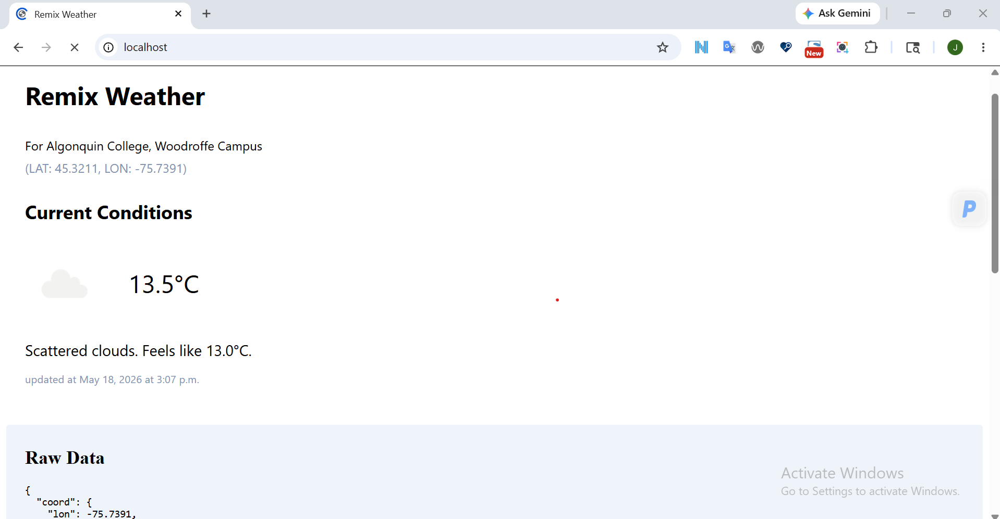
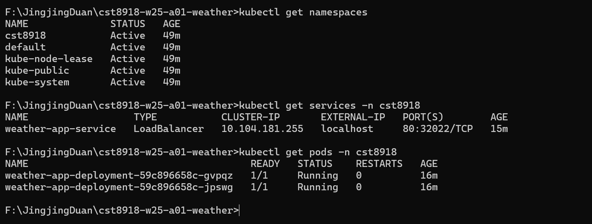

# CST8918 Lab A01 - Weather App

## Overview

This project is a weather application built with Remix and React.
The application retrieves weather data from the OpenWeather API.

The application is containerized using Docker and deployed locally with Kubernetes on Docker Desktop.

---
## Demo Screenshot:
* Browser with the app running at http://localhost


* kubectl get namespaces
* kubectl get services -n cst8918
* kubectl get pods -n cst8918


---
## Demo k8s folder
https://github.com/Jingjing-Duan/cst8918-w25-a01-weather/tree/main/k8s


## Local Development

Install dependencies:

```bash
npm install
```

Run development server:
```bash
npm run dev
```

## Docker
Build Docker image:

```bash
docker build --tag=cst8918-a01-weather-app .
```

Run container:
```bash
docker run -d --name weather -p 8080:8080 --env WEATHER_API_KEY=YOUR_API_KEY cst8918-a01-weather-app
```

## Kubernetes

Apply namespace:

```bash
kubectl apply -f ./k8s/a01_namespace.yaml
```

Create secret:

```bash
kubectl create secret generic weather --from-literal=api-key=YOUR_API_KEY -n cst8918
```

Apply deployment:

```bash
kubectl apply -f ./k8s/a01_deployment.yaml -n cst8918
```

Apply service:

```bash
kubectl apply -f ./k8s/a01_service.yaml -n cst8918
```

## Kubernetes Resources
* Namespace
* Deployment
* Service
* Secret

## Author
Jingjing Duan
